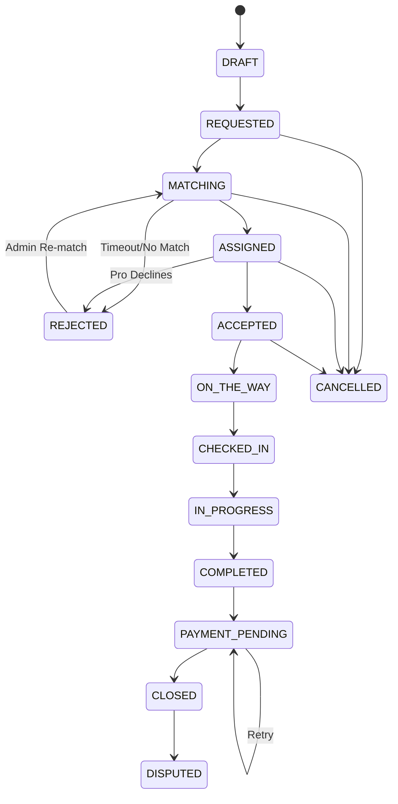
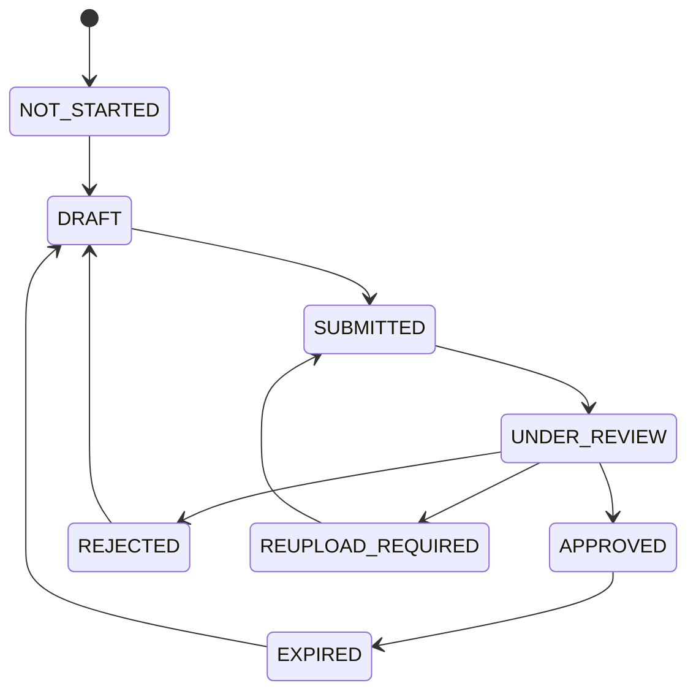
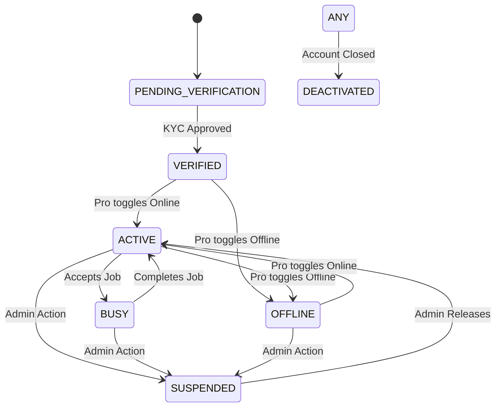

# 09. State Machine & Status System Specification

## Overview
This document defines the centralized state machines for ALL major entities within the Healthcare Staffing & Home Care Platform. 
**[TECHNICAL RULE]** No page, component, or module may hard-code its own status behavior or strings. All state transitions, label resolutions, and color mappings MUST be driven by this centralized specification.

**[UI RULE]** This is a LIGHT THEME ONLY product.
**[UI RULE]** Primary text color is `#0F172A` (never pure `#000000`).
**[UI RULE]** Brand colors are Healthcare Teal (`#0EA5A4`) and Medical Blue (`#2563EB`).
**[UI RULE]** Font is Manrope (with Inter fallback).
**[UI RULE]** All icons used in status indicators MUST be from the `lucide-react` library.

---

## 1. Booking Status Machine

This is the MOST CRITICAL state machine in the platform, governing the lifecycle of a patient's or organization's request for care.

### 1.1 States

| State | UI Label | Color | Icon (Lucide) | Description |
|---|---|---|---|---|
| `DRAFT` | Draft | neutral (`#64748B`) | `FileEdit` | Booking started but not submitted |
| `REQUESTED` | Requested | warning (`#D97706`) | `Clock` | Client submitted booking request |
| `MATCHING` | Matching | info (`#2563EB`) | `Search` | System searching for eligible professionals |
| `ASSIGNED` | Assigned | info (`#2563EB`) | `UserCheck` | Professional assigned, awaiting acceptance |
| `ACCEPTED` | Accepted | success (`#16A34A`) | `CheckCircle` | Professional accepted the booking |
| `ON_THE_WAY` | On The Way | info (`#2563EB`) | `Navigation` | Professional traveling to location |
| `CHECKED_IN` | Checked In | success (`#16A34A`) | `MapPin` | Professional arrived and checked in |
| `IN_PROGRESS` | In Progress | brand-teal (`#0EA5A4`) | `Activity` | Service being performed |
| `COMPLETED` | Completed | success (`#16A34A`) | `CheckCircle2` | Visit completed successfully |
| `PAYMENT_PENDING` | Payment Pending | warning (`#D97706`) | `CreditCard` | Awaiting payment processing |
| `CLOSED` | Closed | neutral (`#64748B`) | `Archive` | Booking fully completed and closed |
| `REJECTED` | Rejected | danger (`#DC2626`) | `XCircle` | Professional rejected the booking |
| `CANCELLED` | Cancelled | danger (`#DC2626`) | `Ban` | Booking cancelled by client or admin |
| `DISPUTED` | Disputed | danger (`#DC2626`) | `AlertTriangle` | Booking under dispute review |

#### State Diagram


### 1.2 State Transitions

For each transition, the system must validate the condition, trigger notifications, and log an audit event.

| From | To | Trigger | Actor | Conditions | Notifications | Audit Event |
|---|---|---|---|---|---|---|
| `DRAFT` | `REQUESTED` | Client submits booking | Client | Valid service, location, time, payment method | Professional(s), Admin | `BKG_SUBMITTED` |
| `REQUESTED` | `MATCHING` | System initiates matching | System | Booking validated | Client (matching started) | `BKG_MATCHING_STARTED` |
| `MATCHING` | `ASSIGNED` | System finds eligible pro | System | Eligible professional found | Professional (new job offer) | `BKG_ASSIGNED` |
| `MATCHING` | `REJECTED` | No eligible professional | System | Timeout / no match | Client, Admin | `BKG_NO_MATCH` |
| `ASSIGNED` | `ACCEPTED` | Professional accepts | Pro | Within acceptance timeout | Client (pro accepted) | `BKG_ACCEPTED` |
| `ASSIGNED` | `REJECTED` | Professional declines | Pro | - | Admin (needs reassignment) | `BKG_DECLINED` |
| `ACCEPTED` | `ON_THE_WAY` | Professional starts travel | Pro | - | Client (pro on the way) | `BKG_TRAVEL_STARTED` |
| `ON_THE_WAY` | `CHECKED_IN` | Professional checks in | Pro | **[ASSUMPTION]** Proximity check via mobile | Client (pro arrived) | `BKG_CHECKED_IN` |
| `CHECKED_IN` | `IN_PROGRESS` | Service begins | Pro | - | Client | `BKG_SERVICE_STARTED` |
| `IN_PROGRESS` | `COMPLETED` | Service finished | Pro | All required fields complete | Client, Admin | `BKG_COMPLETED` |
| `COMPLETED` | `PAYMENT_PENDING` | Payment initiated | System | - | Client | `BKG_PAYMENT_INITIATED` |
| `PAYMENT_PENDING` | `CLOSED` | Payment successful | System | Payment confirmed | Client, Professional | `BKG_CLOSED` |
| `PAYMENT_PENDING` | `PAYMENT_PENDING` | Payment failed | System | - | Client (retry) | `BKG_PAYMENT_FAILED` |
| `ANY (pre-completion)` | `CANCELLED` | Cancellation request | Client/Admin | Cancellation policy limits | All parties | `BKG_CANCELLED` |
| `CLOSED` | `DISPUTED` | Dispute raised | Client | Within dispute window | Admin, Professional | `BKG_DISPUTED` |
| `REJECTED` | `MATCHING` | Admin re-triggers matching | Admin | Manual intervention | - | `BKG_REMATCHING` |

### 1.3 Allowed Actions per State

**[SECURITY RULE]** The backend MUST strictly enforce these allowed actions via Role-Based Access Control (RBAC).

| State | Client Can | Professional Can | Admin Can |
|---|---|---|---|
| `DRAFT` | Edit, Submit, Cancel | - | View |
| `REQUESTED` | Cancel | - | View, Cancel, Manual Match |
| `MATCHING` | Cancel | - | View, Manual Assign |
| `ASSIGNED` | Cancel | Accept, Reject | View, Reassign, Cancel |
| `ACCEPTED` | Cancel (with penalty) | Start Travel | View, Reassign, Cancel |
| `ON_THE_WAY` | Contact Pro | Check In | View |
| `CHECKED_IN` | Contact Pro | Start Service | View |
| `IN_PROGRESS` | Contact Pro, Report Issue | Add Notes, Complete | View |
| `COMPLETED` | Review, Report Issue | - | View |
| `PAYMENT_PENDING` | Retry Payment | - | View, Override |
| `CLOSED` | View, Dispute | View | View |
| `REJECTED` | - | - | View, Re-match |
| `CANCELLED` | - | - | View |
| `DISPUTED` | Provide Info | Provide Info | Resolve Dispute |

### 1.4 Timeline Behavior
**[BUSINESS RULE]** Each booking maintains an ordered history of state transitions with timestamp, actor ID, actor role, and optional note.
**[UI RULE]** The timeline is rendered vertically on the Booking Details page for all roles, filtering out internal system logs for Clients and Pros.

---

## 2. KYC Verification Status Machine

Governs the compliance, credentialing, and identity verification of Healthcare Professionals.

### 2.1 States

| State | UI Label | Color | Icon | Description |
|---|---|---|---|---|
| `NOT_STARTED` | Not Started | neutral (`#64748B`) | `FileQuestion` | Professional hasn't begun KYC |
| `DRAFT` | Draft | neutral (`#64748B`) | `FilePen` | Documents partially uploaded |
| `SUBMITTED` | Submitted | warning (`#D97706`) | `Upload` | Documents submitted for review |
| `UNDER_REVIEW` | Under Review | info (`#2563EB`) | `Eye` | Admin reviewing documents |
| `APPROVED` | Approved | success (`#16A34A`) | `ShieldCheck` | KYC approved, professional verified |
| `REJECTED` | Rejected | danger (`#DC2626`) | `ShieldX` | KYC rejected with reason |
| `REUPLOAD_REQUIRED` | Re-upload Required | warning (`#D97706`) | `RotateCcw` | Specific documents need re-upload |
| `EXPIRED` | Expired | danger (`#DC2626`) | `Clock` | Verification has expired |

#### State Diagram


### 2.2 Transitions

| From | To | Trigger | Actor | Conditions | Notifications | Audit Event |
|---|---|---|---|---|---|---|
| `NOT_STARTED` | `DRAFT` | First document uploaded | Pro | - | - | `KYC_STARTED` |
| `DRAFT` | `SUBMITTED` | Pro submits application | Pro | All required docs uploaded | Admin | `KYC_SUBMITTED` |
| `SUBMITTED` | `UNDER_REVIEW`| Admin opens profile | Admin | - | - | `KYC_REVIEW_STARTED` |
| `UNDER_REVIEW` | `APPROVED` | Admin approves all docs | Admin | Manual verification passed | Pro (Welcome) | `KYC_APPROVED` |
| `UNDER_REVIEW` | `REJECTED` | Admin rejects application | Admin | Fraud/Ineligible | Pro (Rejected) | `KYC_REJECTED` |
| `UNDER_REVIEW` | `REUPLOAD_REQUIRED`| Admin flags specific docs | Admin | Docs illegible/invalid | Pro (Action req.) | `KYC_REUPLOAD_REQ` |
| `APPROVED` | `EXPIRED` | License/Doc reaches expiry| System| Expiry date < Today | Pro (Warning prior)| `KYC_EXPIRED` |

### 2.3 Rejection Rules
**[BUSINESS RULE]** Rejection MUST include a reason (free text + optional category).
**[BUSINESS RULE]** Categories allowed: Blurry Image, Invalid Document, Expired Document, Mismatch, Incomplete, Other.
**[UI RULE]** Professional must be notified with specific re-upload instructions highlighted in warning colors.

---

## 3. Payment Status Machine

Tracks the lifecycle of incoming funds from the Client to the Platform.

### 3.1 States

| State | UI Label | Color | Description |
|---|---|---|---|
| `PENDING` | Pending | warning (`#D97706`) | Payment initiated but not processed |
| `PROCESSING` | Processing | info (`#2563EB`) | Gateway is processing payment |
| `COMPLETED` | Completed | success (`#16A34A`) | Funds successfully captured |
| `FAILED` | Failed | danger (`#DC2626`) | Payment failed (insufficient funds, etc.) |
| `REFUND_REQUESTED` | Refund Requested | warning (`#D97706`) | Admin/Client initiated refund |
| `REFUNDED` | Refunded | neutral (`#64748B`) | Funds returned to Client |
| `DISPUTED` | Disputed | danger (`#DC2626`) | Chargeback or payment dispute active |

### 3.2 Transitions

| From | To | Trigger | Actor |
|---|---|---|---|
| `PENDING` | `PROCESSING` | Call to Payment Gateway | System |
| `PROCESSING`| `COMPLETED` | Webhook success | Gateway |
| `PROCESSING`| `FAILED` | Webhook failure | Gateway |
| `COMPLETED` | `REFUND_REQUESTED`| Request via Admin | Admin/System|
| `REFUND_REQUESTED` | `REFUNDED` | Gateway confirms refund | Gateway |
| `COMPLETED` | `DISPUTED` | Chargeback webhook | Gateway |

---

## 4. Payout Status Machine

Tracks the lifecycle of outgoing funds from the Platform to the Healthcare Professional.

**[ASSUMPTION]** Exact payout mechanics (Stripe Connect, direct ACH, timing) require separate production validation based on local financial regulations.

### 4.1 States

| State | UI Label | Color | Description |
|---|---|---|---|
| `NOT_ELIGIBLE` | Not Eligible | neutral (`#64748B`) | Job not complete or minimum threshold not met |
| `ELIGIBLE` | Eligible | info (`#2563EB`) | Ready to be processed in next batch |
| `PROCESSING` | Processing | warning (`#D97706`) | Batch sent to payout provider |
| `COMPLETED` | Completed | success (`#16A34A`) | Funds hit Professional's account |
| `FAILED` | Failed | danger (`#DC2626`) | Bank rejected transfer |
| `HELD` | On Hold | warning (`#D97706`) | Admin hold due to dispute/fraud |

### 4.2 Transitions
**[ASSUMPTION]** Payouts are generated automatically upon Booking `COMPLETED` state but are batched daily/weekly.

| From | To | Trigger | Actor |
|---|---|---|---|
| `NOT_ELIGIBLE` | `ELIGIBLE` | Booking hits COMPLETED | System |
| `ELIGIBLE` | `PROCESSING` | Batch CRON runs | System |
| `PROCESSING`| `COMPLETED` | Bank/Gateway confirmation | Gateway |
| `PROCESSING`| `FAILED` | Bank/Gateway rejection | Gateway |
| `ELIGIBLE` | `HELD` | Admin intervenes or Dispute | Admin |
| `HELD` | `ELIGIBLE` | Hold released | Admin |

---

## 5. Professional Status Machine

Determines the overall availability and operational state of a Professional in the marketplace.

### 5.1 States

| State | UI Label | Color |
|---|---|---|
| `PENDING_VERIFICATION` | Pending Verification | warning (`#D97706`) |
| `VERIFIED` | Verified | success (`#16A34A`) |
| `ACTIVE` | Active (Online) | success (`#16A34A`) |
| `OFFLINE` | Offline | neutral (`#64748B`) |
| `BUSY` | Busy (In Visit) | info (`#2563EB`) |
| `SUSPENDED` | Suspended | danger (`#DC2626`) |
| `DEACTIVATED` | Deactivated | neutral (`#64748B`) |

#### State Diagram


### 5.2 Allowed Actions

| State | Matching Eligibility | Login Allowed | Can Edit Profile |
|---|---|---|---|
| `PENDING_VERIFICATION` | No | Yes | Yes (KYC only) |
| `VERIFIED` | No | Yes | Yes |
| `ACTIVE` | Yes | Yes | Yes |
| `OFFLINE` | No | Yes | Yes |
| `BUSY` | No | Yes | Yes |
| `SUSPENDED` | No | Yes | No |
| `DEACTIVATED` | No | No | No |

---

## 6. Support Ticket Status Machine

### 6.1 States

| State | UI Label | Color |
|---|---|---|
| `OPEN` | Open | warning (`#D97706`) |
| `ASSIGNED` | Assigned | info (`#2563EB`) |
| `IN_PROGRESS` | In Progress | info (`#2563EB`) |
| `RESOLVED` | Resolved | success (`#16A34A`) |
| `REOPENED` | Reopened | warning (`#D97706`) |
| `CLOSED` | Closed | neutral (`#64748B`) |

### 6.2 Transitions & SLA Expectations
**[ASSUMPTION]** SLA specifics (times) are placeholders and require operational definition.

| From | To | Trigger | SLA / Automation |
|---|---|---|---|
| `OPEN` | `ASSIGNED` | Admin claims / System routes | 1 hour |
| `ASSIGNED` | `IN_PROGRESS` | Admin sends first reply | 2 hours |
| `IN_PROGRESS` | `RESOLVED` | Admin marks resolved | 24 hours |
| `RESOLVED` | `REOPENED` | User replies | - |
| `RESOLVED` | `CLOSED` | 72h pass with no user reply | System auto-close |

---

## 7. Job Request Status Machine

Represents the transient state of an *offer* sent to a specific professional (derived from the Booking `MATCHING` process).

### 7.1 States

| State | UI Label | Color |
|---|---|---|
| `PENDING` | New Request | warning (`#D97706`) |
| `VIEWED` | Viewed | info (`#2563EB`) |
| `ACCEPTED` | Accepted | success (`#16A34A`) |
| `DECLINED` | Declined | danger (`#DC2626`) |
| `EXPIRED` | Expired | neutral (`#64748B`) |
| `REASSIGNED` | Reassigned | info (`#2563EB`) |

### 7.2 Lifecycle Rules
**[BUSINESS RULE]** A Job Request is sent to a Pro. If they do not act within 15 minutes, it moves to `EXPIRED`.
**[BUSINESS RULE]** If `DECLINED` or `EXPIRED`, the matching engine moves to the next candidate, marking the previous request as such.
**[BUSINESS RULE]** If `ACCEPTED`, all other active `PENDING` requests for this specific booking are marked as `REASSIGNED`.

---

## 8. Global Status Rendering Rules

**[UI RULE]** Every status MUST be rendered with: Text Label + Color + Icon.
**[UI RULE]** NEVER communicate status by color alone (Accessibility/WCAG compliance).

### 8.1 Unified Status Badge Component
All frontend applications must utilize a single Shared Status Component to render badges. 

```typescript
// Example Implementation Contract
interface StatusBadgeProps {
  entity: 'BOOKING' | 'KYC' | 'PAYMENT' | 'PAYOUT' | 'PROFESSIONAL' | 'TICKET' | 'JOB';
  status: string; // e.g. 'IN_PROGRESS'
  size?: 'sm' | 'md' | 'lg';
}
```

### 8.2 Color Configuration Restrictions
**[TECHNICAL RULE]** No component may define its own status colors. The following central mapping must be utilized:
*   `success`: Text `#16A34A`, BG `#DCFCE7`, Border `#86EFAC`
*   `warning`: Text `#D97706`, BG `#FEF3C7`, Border `#FCD34D`
*   `danger`: Text `#DC2626`, BG `#FEE2E2`, Border `#FCA5A5`
*   `info`: Text `#2563EB`, BG `#DBEAFE`, Border `#93C5FD`
*   `neutral`: Text `#64748B`, BG `#F1F5F9`, Border `#CBD5E1`
*   `brand-teal`: Text `#0EA5A4`, BG `#E0F2F1`, Border `#99F6E4`

### 8.3 Accessibility (A11y)
*   **[UI RULE]** Badges must include standard ARIA attributes (`role="status"` or `aria-label="Status: [Label]"`) for screen readers.
*   **[UI RULE]** Icons must have `aria-hidden="true"` as the text provides the meaning.

---
*End of Document*
