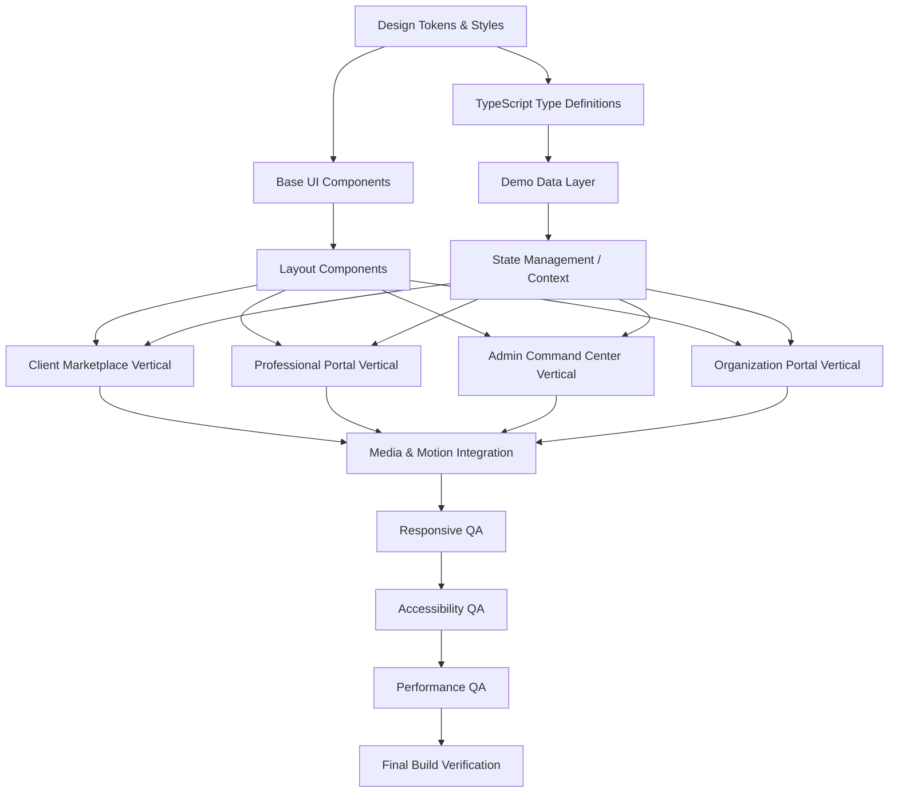

# Implementation Dependency Map & Build Order

## 1. Dependency Philosophy

The following principles dictate the build order and dependency management for the Healthcare Staffing & Home Care Platform. 

- **No page should be built before its dependencies exist** [TECHNICAL RULE]
- **Components before pages**: Base UI components must be completed and tested before being assembled into pages. [TECHNICAL RULE]
- **Tokens before components**: Design tokens (colors, typography, spacing) must be implemented before any UI component styling begins. [UI RULE]
- **Data before state-dependent components**: TypeScript interfaces and demo data must be defined before building components that rely on them. [TECHNICAL RULE]
- **Shared layout before individual screens**: Layout wrappers (navbars, sidebars, footers) must be built before individual screen content. [UI RULE]
- **Each phase has a quality gate**: A phase cannot be considered complete until its quality gate is passed. [BUSINESS RULE]
- **Demo Mode**: The demo role switcher must be placed behind a `demoMode` feature flag. This is not a production navigation pattern. [SECURITY RULE]
- **Compliance & Licensing**: Production healthcare licensing, scope of practice, patient privacy, consent, payments/tax, employment classification, and local regulatory requirements require separate validation. [BUSINESS RULE] [ASSUMPTION]
- **Theming**: This is a LIGHT THEME ONLY product. Primary text is `#0F172A` (never pure `#000000`). Brand colors: Healthcare Teal `#0EA5A4`, Medical Blue `#2563EB`. Font: Manrope (Inter fallback). Icons: Lucide React only. [UI RULE]
- **Unsupported Features**: No escrow, GPS live tracking, specific medical procedures, specific pricing, real payment gateway, exact payout mechanics, specific legal claims, or production regulatory compliance should be stated as confirmed features. [ASSUMPTION]
- **Unknowns**: Any undefined business logic or UI requirements must be explicitly marked as an OPEN DECISION. [BUSINESS RULE]

## 2. Dependency Graph

## 3. Phase Breakdown

### PHASE 1: Foundation (No UI output)
**Goal**: Establish all shared infrastructure that every subsequent phase depends on.

| Step | File(s) | Dependency | Quality Gate | Notes |
|---|---|---|---|---|
| 1.1 | `tailwind.config.js` | None | All colors, spacing, radii, shadows match 07-Design-System.md | [UI RULE] Ensure light theme enforcement. |
| 1.2 | `src/styles/tokens.ts` | 1.1 | Exported color, spacing, typography, shadow, status constants | [TECHNICAL RULE] |
| 1.3 | `src/styles/typography.ts` | 1.1 | Font family (Manrope), weight, size, line-height scale defined | [UI RULE] |
| 1.4 | `src/styles/motion.ts` | None | Duration, easing, animation presets per 08-Interaction-System.md | [UI RULE] |
| 1.5 | `src/styles/status.ts` | 1.2 | Centralized status → color/icon/label mappings | [BUSINESS RULE] |
| 1.6 | `src/styles/layout.ts` | 1.1 | Breakpoints, max-widths, sidebar width, header height | [UI RULE] |
| 1.7 | `index.html` | None | Google Fonts Manrope preload, favicon, meta viewport | [TECHNICAL RULE] |
| 1.8 | `src/index.css` | 1.1 | Tailwind directives, base styles, font-face, global resets | [TECHNICAL RULE] |

**Gate**: All token files compile. `npm run build` passes. Colors `#0EA5A4`, `#2563EB`, and `#0F172A` are strictly implemented.

---

### PHASE 2: Type Definitions & Demo Data
**Goal**: Define all TypeScript interfaces and seed deterministic demo data.

| Step | File(s) | Dependency | Quality Gate |
|---|---|---|---|
| 2.1 | `src/types/index.ts` | None | All interfaces from 10-Data-Model.md defined. [TECHNICAL RULE] |
| 2.2 | `src/types/enums.ts` | None | All status enums defined (Booking, KYC, etc.). [BUSINESS RULE] |
| 2.3 | `src/data/professionals.ts` | 2.1, 2.2 | 20 professionals mock data. [TECHNICAL RULE] |
| 2.4 | `src/data/clients.ts` | 2.1 | 10 clients mock data. [TECHNICAL RULE] |
| 2.5 | `src/data/services.ts` | 2.1 | 10+ services (Nursing, Caregiver, Physio, etc.). [BUSINESS RULE] |
| 2.6 | `src/data/bookings.ts` | 2.1-2.5 | 25 bookings across all 14 states. [BUSINESS RULE] |
| 2.7 | `src/data/payments.ts` | 2.6 | 15 payment records (Mocked). [ASSUMPTION] |
| 2.8 | `src/data/payouts.ts` | 2.3, 2.6 | 10 payout records. [ASSUMPTION] |
| 2.9 | `src/data/support.ts` | 2.1 | 8 support tickets. [TECHNICAL RULE] |
| 2.10 | `src/data/organizations.ts`| 2.1 | 3 organizations mock data. [TECHNICAL RULE] |
| 2.11 | `src/data/reviews.ts` | 2.3, 2.4 | 15 reviews. [TECHNICAL RULE] |
| 2.12 | `src/data/notifications.ts` | 2.1 | 20 notifications. [TECHNICAL RULE] |
| 2.13 | `src/data/auditLogs.ts` | 2.1 | 15 audit log entries. [TECHNICAL RULE] |
| 2.14 | `src/data/index.ts` | 2.3-2.13| Central re-export of all demo data. [TECHNICAL RULE] |

**Gate**: All data files import correctly. Types match interfaces strictly. All booking states represented.

---

### PHASE 3: State Management
**Goal**: Create React context providers and hooks for global state.

| Step | File(s) | Dependency | Quality Gate |
|---|---|---|---|
| 3.1 | `src/context/AppContext.tsx` | 2.14 | Role switching, demo mode flag, current user. [SECURITY RULE] |
| 3.2 | `src/context/BookingContext.tsx`| 2.6 | Booking CRUD, status transitions per state machine. [BUSINESS RULE] |
| 3.3 | `src/context/NotificationContext.tsx`| 2.12 | Unread count, mark as read, notification list. [TECHNICAL RULE] |
| 3.4 | `src/hooks/useRole.ts` | 3.1 | Current role, permissions check. [SECURITY RULE] |
| 3.5 | `src/hooks/useBooking.ts` | 3.2 | Booking state helpers. [TECHNICAL RULE] |
| 3.6 | `src/hooks/useResponsive.ts` | None | Breakpoint detection hook. [UI RULE] |

**Gate**: Context providers wrap app. Role switching works. Demo mode flag toggles successfully without leaking to production builds.

---

### PHASE 4: Base UI Components
**Goal**: Build every shared component from 07-Design-System.md. Lucide React icons MUST be used exclusively.

| Step | Component | Dependency | Quality Gate |
|---|---|---|---|
| 4.1 | `Button` | Phase 1 | All variants (Primary, Secondary, Ghost, Danger), sizes, loading, disabled. [UI RULE] |
| 4.2 | `Input` | Phase 1 | Label, placeholder, helper, error, disabled, focus ring. [UI RULE] |
| 4.3 | `Select` | Phase 1 | Dropdown, selected state, disabled. [UI RULE] |
| 4.4 | `Badge` / `StatusBadge` | 1.5 | All status states render with correct color + icon + text. [UI RULE] |
| 4.5 | `Card` | Phase 1 | Default, interactive (hover shadow), clickable. [UI RULE] |
| 4.6 | `Modal` | Phase 1 | Backdrop, focus trap, Escape close, action footer. [UI RULE] |
| 4.7 | `Drawer` | Phase 1 | Right-slide, full-screen mobile, backdrop, focus trap. [UI RULE] |
| 4.8 | `Tabs` | Phase 1 | Underline indicator, content panel, ARIA. [UI RULE] |
| 4.9 | `Table` | Phase 1 | Header, rows, sort, pagination, empty state. [UI RULE] |
| 4.10 | `Pagination` | Phase 1 | Page numbers, prev/next, items per page. [UI RULE] |
| 4.11 | `Stepper` | Phase 1 | Step indicator, active/completed/upcoming states. [UI RULE] |
| 4.12 | `Timeline` | Phase 1 | Vertical timeline with status nodes. [UI RULE] |
| 4.13 | `Skeleton` | Phase 1 | Card, Table, Profile, Chart skeleton variants. [UI RULE] |
| 4.14 | `EmptyState` | Phase 1 | Icon, headline, description, CTA. [UI RULE] |
| 4.15 | `Toast` | Phase 1 | Success, error, warning, info variants. [UI RULE] |
| 4.16 | `Tooltip` | Phase 1 | Hover/focus trigger, positioned. [UI RULE] |
| 4.17 | `Avatar` | Phase 1 | Image, fallback initials, sizes. [UI RULE] |
| 4.18 | `FileUploader` | Phase 1 | Drag & drop, preview, progress, error. [UI RULE] |
| 4.19 | `ConfirmDialog` | 4.6 | Title, message, reason input, cancel/confirm. [UI RULE] |
| 4.20 | `Dropdown` | Phase 1 | Trigger, menu items, dividers. [UI RULE] |
| 4.21 | `FilterBar` | 4.2, 4.3 | Search + filter chips + clear all. [UI RULE] |
| 4.22 | `MetricCard` | 4.5 | Value, label, trend, icon. [UI RULE] |
| 4.23 | `PriceBreakdown` | Phase 1 | Line items, subtotal, total. [BUSINESS RULE] |
| 4.24 | `DatePicker` | 4.2 | Calendar popup, date selection. [UI RULE] |
| 4.25 | `TimePicker` | 4.2 | Time slot selection. [UI RULE] |
| 4.26 | `Search` | 4.2 | Search icon, clear, debounced. [UI RULE] |

**Gate**: Every component matches Design System spec. All variants render. ARIA attributes present. Strictly no non-Lucide icons used.

---

### PHASE 5: Layout Components
**Goal**: Build navigation shells for each portal.

| Step | Component | Dependency | Quality Gate |
|---|---|---|---|
| 5.1 | `PublicHeader` | Phase 4, 3.1 | Logo, nav links, CTA, responsive hamburger. [UI RULE] |
| 5.2 | `Footer` | Phase 4 | Columns, links, copyright. [UI RULE] |
| 5.3 | `AdminSidebar` | Phase 4, 3.1 | Full sidebar desktop, icon-only tablet, overlay mobile. [UI RULE] |
| 5.4 | `ProBottomNav` | Phase 4, 3.1 | 5-tab bottom bar for mobile professional portal. [UI RULE] |
| 5.5 | `DemoRoleSwitcher` | 3.1 | Role toggle bar, "DEMO MODE" badge, behind demoMode flag. [SECURITY RULE] |
| 5.6 | `PublicLayout` | 5.1, 5.2 | Header + main + footer wrapper. [UI RULE] |
| 5.7 | `AdminLayout` | 5.3 | Sidebar + main content wrapper. [UI RULE] |
| 5.8 | `ProLayout` | 5.1, 5.4 | Top header (desktop) + bottom nav (mobile) wrapper. [UI RULE] |
| 5.9 | `OrgLayout` | 5.1 | Standard header layout for organization. [UI RULE] |

**Gate**: All layouts render. Navigation works. Responsive breakpoints verified. Demo switcher works securely.

---

### PHASE 6: Domain Components
**Goal**: Build business-specific components shared across pages.

| Step | Component | Dependency | Quality Gate |
|---|---|---|---|
| 6.1 | `ServiceCard` | 4.5 | Service name, icon, description, CTA. [UI RULE] |
| 6.2 | `ProfessionalCard`| 4.5, 4.17 | Photo, verified badge, name, category, rating, price, distance, CTA. [BUSINESS RULE] |
| 6.3 | `BookingStepper` | 4.11 | 10-step booking progress. [UI RULE] |
| 6.4 | `BookingTimeline` | 4.12 | Status history with timestamps. [BUSINESS RULE] |
| 6.5 | `BookingSummary` | 4.5, 4.23 | Booking details + price breakdown. [BUSINESS RULE] |
| 6.6 | `JobRequestCard` | 4.5 | Service, time, distance, earning, countdown timer, accept/reject. [BUSINESS RULE] |
| 6.7 | `ActiveVisitPanel` | 4.5 | Status, timer, check-in/out, notes. [BUSINESS RULE] |
| 6.8 | `AvailabilityToggle`| Phase 4 | Online/offline switch with status indicator. [BUSINESS RULE] |
| 6.9 | `EarningsSummary` | 4.22 | Total earnings, pending, processed. [BUSINESS RULE] |
| 6.10 | `KYCDocumentCard` | 4.5, 4.18 | Document type, status, preview, upload. [BUSINESS RULE] |
| 6.11 | `VerificationBanner`| 4.4 | KYC status with appropriate messaging. [UI RULE] |
| 6.12 | `KPICard` | 4.22 | Admin dashboard metric card. [UI RULE] |
| 6.13 | `VerificationQueue`| 4.9 | Table with drawer trigger for KYC. [BUSINESS RULE] |
| 6.14 | `BookingTable` | 4.9 | Admin booking list with filters. [BUSINESS RULE] |
| 6.15 | `PayoutTable` | 4.9 | Admin payout list with batch action. [BUSINESS RULE] |
| 6.16 | `SupportQueue` | 4.9 | Support ticket table with priority badges. [BUSINESS RULE] |
| 6.17 | `ShiftCard` | 4.5 | Organization shift details. [BUSINESS RULE] |
| 6.18 | `RosterTable` | 4.9 | Organization roster table. [BUSINESS RULE] |
| 6.19 | `MapContainer` | Phase 4 | Custom SVG map with markers. [UI RULE] |
| 6.20 | `ProfileHeader` | 4.17 | Professional profile hero section. [UI RULE] |
| 6.21 | `ReviewCard` | 4.5 | Rating stars, text, author, date. [BUSINESS RULE] |
| 6.22 | `NotificationPanel`| 4.7 | Notification dropdown/drawer. [UI RULE] |

**Gate**: All domain components render with demo data. Props typed. Status badges use centralized config.

---

### PHASE 7: Client Marketplace Vertical Slice
**Goal**: Complete client-facing experience end-to-end.

| Step | Screen | Route | Dependency | Acceptance Criteria |
|---|---|---|---|---|
| 7.1 | Homepage | `/` | 5.6, 6.1, 6.2 | GIVEN the user is on the homepage, THEN they see hero, services, workflow, and CTAs. [UI RULE] |
| 7.2 | Services | `/services` | 7.1, 6.1 | GIVEN the user visits `/services`, THEN all 5 service categories (Nursing, Caregiver, Physio, Doctor, Specialized) are visible. [BUSINESS RULE] |
| 7.3 | Search & Map | `/search` | 6.2, 6.19 | GIVEN the user searches for a professional, THEN they see a split view with filters, map markers, and empty states if none found. [UI RULE] |
| 7.4 | Professional Profile | `/pro/:id` | 6.20, 6.21 | GIVEN a user views a profile, THEN the full profile and sticky booking CTA render. [UI RULE] |
| 7.5 | Booking Wizard (10 steps) | `/book` | 6.3, 6.5, 4.23 | GIVEN a user initiates a booking, WHEN they step through the wizard, THEN progressive disclosure and fee calculation function correctly. [BUSINESS RULE] |
| 7.6 | My Bookings | `/my-bookings` | 6.4, 4.4 | GIVEN a client has bookings, THEN they are listed with proper status badges. [BUSINESS RULE] |
| 7.7 | Booking Tracking | `/booking/:id/track`| 6.4 | GIVEN a client tracks an active booking, THEN a timeline, status, and professional info are displayed. [BUSINESS RULE] |
| 7.8 | Client Support | `/support` | 4.2, 4.18 | GIVEN a client needs help, THEN a ticket form and list are available. [BUSINESS RULE] |

**Vertical Slice Gate** (before proceeding to Phase 8):
- [ ] All client routes resolve
- [ ] Responsive at 375px, 768px, 1280px
- [ ] All states rendered (loading, empty, error, success)
- [ ] Consistent design tokens
- [ ] Navigation works
- [ ] Booking wizard preserves state across steps

---

### PHASE 8: Professional Portal Vertical Slice
**Goal**: Complete professional experience end-to-end.

| Step | Screen | Route | Acceptance Criteria |
|---|---|---|---|
| 8.1 | Dashboard | `/pro/dashboard` | GIVEN the pro is logged in, THEN they see an availability toggle, today's jobs, and active visit banner. [BUSINESS RULE] |
| 8.2 | Job Requests | `/pro/jobs` | GIVEN the pro receives a job, THEN they see a countdown timer to accept/reject. [BUSINESS RULE] |
| 8.3 | Active Visit | `/pro/visit/:id` | GIVEN an active visit is occurring, THEN check-in/out and notes are visible. [BUSINESS RULE] |
| 8.4 | Schedule | `/pro/schedule` | GIVEN the pro views schedule, THEN calendar and availability slots are displayed. [UI RULE] |
| 8.5 | Earnings | `/pro/earnings` | GIVEN the pro views earnings, THEN chart, payout history, and breakdowns are shown. [BUSINESS RULE] |
| 8.6 | KYC | `/pro/kyc` | GIVEN the pro updates documents, THEN upload tools, status banner, and audit history show. [BUSINESS RULE] |
| 8.7 | Profile | `/pro/profile` | GIVEN the pro views profile, THEN they can edit and save changes. [BUSINESS RULE] |

**Vertical Slice Gate**: Same checks as Phase 7 + bottom nav works on mobile.

---

### PHASE 9: Admin Command Center Vertical Slice
**Goal**: Complete admin experience end-to-end.

| Step | Screen | Route | Acceptance Criteria |
|---|---|---|---|
| 9.1 | Dashboard | `/admin/dashboard` | GIVEN admin is logged in, THEN KPIs, operations feed, and quick actions are shown. [BUSINESS RULE] |
| 9.2 | Verification Queue | `/admin/verification`| GIVEN there are pending KYCs, THEN a table, drawer inspector, and approve/reject actions are shown. [BUSINESS RULE] |
| 9.3 | Professional List | `/admin/professionals` | GIVEN the admin manages pros, THEN a searchable/filterable table is shown. [UI RULE] |
| 9.4 | Bookings | `/admin/bookings` | GIVEN the admin manages bookings, THEN a status-filtered table with drawer details is visible. [BUSINESS RULE] |
| 9.5 | Payments | `/admin/payments` | GIVEN the admin checks finance, THEN transactions and export options are visible. [BUSINESS RULE] |
| 9.6 | Payouts | `/admin/payouts` | GIVEN the admin processes payouts, THEN batch process actions work via UI. [BUSINESS RULE] |
| 9.7 | Support Desk | `/admin/support` | GIVEN tickets exist, THEN a ticket queue with priority badges is shown. [BUSINESS RULE] |
| 9.8 | Services & Pricing | `/admin/services` | GIVEN the admin edits services, THEN a management table is provided. [BUSINESS RULE] |

**Vertical Slice Gate**: Same checks + all destructive actions have confirmation dialogs.

---

### PHASE 10: Organization Portal
**Goal**: Complete organization (hospital/corporate) experience.

| Step | Screen | Route | Gate / Acceptance Criteria |
|---|---|---|---|
| 10.1 | Dashboard | `/org/dashboard` | GIVEN the org user logs in, THEN they see an overview and active shifts. [BUSINESS RULE] |
| 10.2 | Staffing Request | `/org/request` | GIVEN the org needs staff, THEN they can submit a request form with requirements. [BUSINESS RULE] |
| 10.3 | Roster | `/org/roster` | GIVEN the org reviews staff, THEN an assigned staff table (Roster) is shown. [BUSINESS RULE] |

---

### PHASE 11: Media & Motion Integration
- Add entrance animations per `08-Interaction-System.md`. [UI RULE]
- Add scroll reveals for marketing sections. [UI RULE]
- Add hover/focus transitions. [UI RULE]
- Add skeleton → content transitions. [UI RULE]
- Add Lottie animations for success/upload/search states. [UI RULE]
- Add video posters and lazy loading. [TECHNICAL RULE]

---

### PHASE 12: Quality Assurance
| Check | Document Reference | Pass Criteria | Notes |
|---|---|---|---|
| Visual QA | `07-Design-System.md` | All tokens match | STRICT LIGHT THEME. Primary text `#0F172A`. |
| Responsive QA | `15-Responsive-System.md`| All breakpoints verified | Test on `375px`, `768px`, `1280px`. |
| Accessibility QA | `13-Accessibility.md` | Keyboard, focus, ARIA, contrast | Must pass WCAG 2.1 AA. |
| Performance QA | `19-Performance-and-SEO.md` | Lighthouse > 90 | Verify bundle sizes and LCP. |
| State QA | `09-State-Machine.md` | All states rendered | Test Booking and KYC states. |
| Error QA | `16-Error-Edge-Case-Matrix.md`| All errors handled | Check offline states. |
| Empty State QA | `16-Error-Edge-Case-Matrix.md`| All empty states present | Ensure illustrations exist. |
| Build QA | - | `npm run build` passes | No ESLint/TS errors. |
| Route QA | `03-Information-Architecture.md`| All routes resolve | Ensure 404 page is styled. |

---

## 4. Build Gates (Mandatory)

| Gate | After Phase | Must Pass Before | Validation Criteria |
|---|---|---|---|
| **GATE-1: Foundation** | Phase 1-2 | Phase 3+ | All base configurations, styles, and demo data are complete and strictly typed. |
| **GATE-2: Components** | Phase 3-4 | Phase 5+ | All global states and base UI components match the design system. Lucide icons verified. |
| **GATE-3: Layouts** | Phase 5-6 | Phase 7+ | Layouts are fully responsive. Domain specific components handle demo data gracefully. |
| **GATE-4: Client Slice** | Phase 7 | Phase 8 | Client marketplace flow operates seamlessly from start to finish. |
| **GATE-5: Pro Slice** | Phase 8 | Phase 9 | Professional portal allows job acceptance, scheduling, and KYC management. |
| **GATE-6: Admin Slice** | Phase 9 | Phase 10 | Admin panel provides full oversight. Destructive actions prompt confirmations. |
| **GATE-7: Full Build** | Phase 10-11 | Phase 12 | Organization portal is functional, and all animations/media are integrated. |
| **GATE-8: QA Complete** | Phase 12 | Release | 100% of the checks in Phase 12 have passed. No known high-severity bugs. |

### Note on Unknowns / Assumptions
- **[ASSUMPTION]**: Specific payment gateways, payout structures, escrow accounts, and live GPS tracking are assumed to be non-existent or mocked in the initial release unless explicitly designed. 
- **[OPEN DECISION]**: Exact healthcare compliance mechanisms (HIPAA equivalents in local regions) and tax withholding setups are pending final legal review and are currently simulated via demo data.
