# CareConnect Client Journey Map

## 1. Overview
This document maps the complete end-to-end journey for a client on the CareConnect platform. It details every transition from initial discovery through booking, service delivery, and post-care actions.

## 2. High-Level Flow Diagram

```mermaid
flowchart TD
    %% Discovery
    A[First Visit] --> B[Homepage]
    B --> C[Service Discovery]
    C --> D[Service Detail]
    
    %% Booking Wizard
    D --> E[Book Service]
    E --> F[Step 1: Service]
    F --> G[Step 2: Care Req]
    G --> H[Step 3: Patient]
    H --> I[Step 4: Location]
    I --> J[Step 5: Date]
    J --> K[Step 6: Time/Shift]
    K --> L[Step 7: Staff Pref]
    L --> M[Step 8: Special Req]
    M --> N[Step 9: Price Review]
    N --> O[Step 10: Final Review]
    
    %% Auth & Submit
    O --> P{Authenticated?}
    P -->|No| Q[Authentication]
    Q --> R[Submit Request]
    P -->|Yes| R
    
    %% Operations & Delivery
    R --> S[Request Received]
    S --> T[Operations Review]
    T --> U[Staff Assignment]
    U --> V[Care Confirmed]
    V --> W[Upcoming Care]
    W --> X[Staff Travel]
    X --> Y[Arrival]
    Y --> Z[Care In Progress]
    
    %% Post-Care
    Z --> AA[Care Completed]
    AA --> BB[Payment/Invoice]
    BB --> CC[Review/Feedback]
    CC --> DD[Rebook/Repeat Care]
```

## 3. Detailed Stage Transitions

### Stage 1: First Visit → Homepage
- **Trigger**: User types URL, clicks ad, or uses search engine.
- **UI Change**: Loads the CareConnect homepage with Hero section.
- **Data Dependency**: CMS content for testimonials and dynamic service list.
- **Loading State**: Skeleton loader for dynamic content; hero image optimized.
- **Success Outcome**: User sees value proposition and primary CTAs.
- **Error Outcome**: 500 error page if CMS fails.
- **Next Action**: User scrolls, searches, or clicks a service.

### Stage 2: Homepage → Service Discovery
- **Trigger**: Clicks "View All Services" or "Services" in header.
- **UI Change**: Navigates to `/services` catalog. Grid layout of services.
- **Data Dependency**: Fetch `/api/v1/services` catalog.
- **Loading State**: Grid of skeleton cards.
- **Success Outcome**: List of available services rendered.
- **Error Outcome**: Toast notification "Unable to load services", retry button.
- **Next Action**: User filters, searches, or clicks a specific service card.

### Stage 3: Service Discovery → Service Detail
- **Trigger**: Clicks on a specific service (e.g., Home Nursing).
- **UI Change**: Navigates to `/services/:id`. Detailed view, pricing, scope.
- **Data Dependency**: Fetch `/api/v1/services/:id`.
- **Loading State**: Page-level spinner or skeleton.
- **Success Outcome**: Displays detailed descriptions, inclusions/exclusions, pricing.
- **Error Outcome**: 404 page if service ID invalid.
- **Next Action**: User clicks "Book Now".

### Stage 4: Service Detail → Book Service
- **Trigger**: User clicks primary "Book Now" CTA.
- **UI Change**: Navigates to `/client/booking/wizard`.
- **Data Dependency**: Initialize booking draft in local state/session.
- **Loading State**: Quick transition, no heavy loading.
- **Success Outcome**: Wizard UI opens.
- **Error Outcome**: N/A.
- **Next Action**: Begin Step 1.

### Stage 5: Book Service → Step 1: Service Selection
- **Trigger**: Auto-transition from Stage 4.
- **UI Change**: Wizard displays Step 1 (Confirm Service). Pre-selected from previous page.
- **Data Dependency**: Service catalog metadata.
- **Loading State**: None.
- **Success Outcome**: User sees selected service and sub-options (e.g., 12hr vs 24hr nursing).
- **Error Outcome**: N/A.
- **Next Action**: User selects sub-option and clicks "Next".

### Stage 6: Step 1 → Step 2: Care Requirement
- **Trigger**: Clicks "Next" on Step 1.
- **UI Change**: Slides to Step 2. Form asking "What specific care is needed?".
- **Data Dependency**: Service-specific questionnaire config.
- **Loading State**: Smooth slide transition.
- **Success Outcome**: User sees checkboxes/text areas for condition details (e.g., Post-op, Dementia).
- **Error Outcome**: Validation error if required fields missed.
- **Next Action**: Fill form, click "Next".

### Stage 7: Step 2 → Step 3: Patient Selection
- **Trigger**: Clicks "Next" on Step 2.
- **UI Change**: Slides to Step 3. Asks "Who is this care for?".
- **Data Dependency**: If auth'd, fetch `/api/v1/users/patients`.
- **Loading State**: Skeleton for patient list.
- **Success Outcome**: Shows existing patients or form to add a new patient (Name, Age, Gender, Weight).
- **Error Outcome**: API error toast.
- **Next Action**: Select or add patient, click "Next".

### Stage 8: Step 3 → Step 4: Location
- **Trigger**: Clicks "Next" on Step 3.
- **UI Change**: Slides to Step 4. Asks "Where is care needed?".
- **Data Dependency**: If auth'd, fetch `/api/v1/users/addresses`.
- **Loading State**: Map initialization, address list skeleton.
- **Success Outcome**: Select saved address or enter new address (Pin code verification required).
- **Error Outcome**: "Service not available in this area" validation error based on pin code.
- **Next Action**: Select address, click "Next".

### Stage 9: Step 4 → Step 5: Date
- **Trigger**: Clicks "Next" on Step 4.
- **UI Change**: Slides to Step 5. Calendar view.
- **Data Dependency**: Fetch available dates (holiday exclusions).
- **Loading State**: Calendar spinner.
- **Success Outcome**: User can select Start Date and End Date (if recurring).
- **Error Outcome**: N/A.
- **Next Action**: Select dates, click "Next".

### Stage 10: Step 5 → Step 6: Time/Shift
- **Trigger**: Clicks "Next" on Step 5.
- **UI Change**: Slides to Step 6. Time selection.
- **Data Dependency**: Depends on service type (e.g., hourly slots vs 12-hour shifts: Day/Night).
- **Loading State**: None.
- **Success Outcome**: User selects specific time or shift preference.
- **Error Outcome**: N/A.
- **Next Action**: Select time, click "Next".

### Stage 11: Step 6 → Step 7: Staff Preferences
- **Trigger**: Clicks "Next" on Step 6.
- **UI Change**: Slides to Step 7. Preferences (Gender preference, Language).
- **Data Dependency**: None.
- **Loading State**: None.
- **Success Outcome**: Optional dropdowns for preferences.
- **Error Outcome**: N/A.
- **Next Action**: Make selection, click "Next".

### Stage 12: Step 7 → Step 8: Special Requirements
- **Trigger**: Clicks "Next" on Step 7.
- **UI Change**: Slides to Step 8. Free text area for instructions (e.g., "Beware of dog", "Parking available").
- **Data Dependency**: None.
- **Loading State**: None.
- **Success Outcome**: Text area visible.
- **Error Outcome**: N/A.
- **Next Action**: Enter text, click "Next".

### Stage 13: Step 8 → Step 9: Price Review
- **Trigger**: Clicks "Next" on Step 8.
- **UI Change**: Slides to Step 9. Detailed cost breakdown.
- **Data Dependency**: Compute pricing based on draft data via `/api/v1/pricing/calculate`.
- **Loading State**: Spinner while calculating taxes/discounts.
- **Success Outcome**: Line items for base rate, taxes, total estimated cost.
- **Error Outcome**: "Pricing calculation failed" toast.
- **Next Action**: Review and click "Next".

### Stage 14: Step 9 → Step 10: Final Review
- **Trigger**: Clicks "Next" on Step 9.
- **UI Change**: Slides to Step 10. Comprehensive summary of all previous steps.
- **Data Dependency**: Local draft state.
- **Loading State**: None.
- **Success Outcome**: Client reviews Service, Patient, Location, Dates, Total.
- **Error Outcome**: N/A.
- **Next Action**: Click "Submit Request".

### Stage 15: Step 10 → Authentication (if needed)
- **Trigger**: Clicks "Submit Request" but is not logged in.
- **UI Change**: Modal overlay prompting Login / OTP signup.
- **Data Dependency**: Auth APIs.
- **Loading State**: Button spinners during OTP send/verify.
- **Success Outcome**: User authenticated, session token stored.
- **Error Outcome**: Invalid OTP, user must retry.
- **Next Action**: Automatic transition back to Submit logic.

### Stage 16: Authentication → Submit Request
- **Trigger**: Auth success OR user was already logged in on Step 10.
- **UI Change**: "Submit Request" button shows loading spinner.
- **Data Dependency**: POST to `/api/v1/bookings`.
- **Loading State**: Overlay with "Processing your request..."
- **Success Outcome**: Receives HTTP 201 with Booking ID.
- **Error Outcome**: HTTP 400/500, displays error message.
- **Next Action**: Transition to Success screen.

### Stage 17: Submit → Request Received
- **Trigger**: Successful POST response.
- **UI Change**: Redirect to `/client/bookings/:id?status=success`. Success confetti/animation.
- **Data Dependency**: Fetch booking detail.
- **Loading State**: Skeleton for booking detail.
- **Success Outcome**: "Your request is under review" message. SMS/Email confirmation sent.
- **Error Outcome**: N/A.
- **Next Action**: Client waits for confirmation.

### Stage 18: Request Received → Operations Review
- **Trigger**: Internal operations dashboard flags new request.
- **UI Change**: (Client Side) Status changes to "Under Review".
- **Data Dependency**: WebSocket/Polling for status update on client side.
- **Loading State**: N/A.
- **Success Outcome**: Operations approves.
- **Error Outcome**: Operations rejects (Service unavailable).
- **Next Action**: Move to assignment.

### Stage 19: Operations Review → Staff Assignment
- **Trigger**: Operations assigns staff.
- **UI Change**: (Client Side) Status remains "Processing" but may indicate "Assigning Caregiver".
- **Data Dependency**: Internal ops mapping.
- **Loading State**: N/A.
- **Success Outcome**: Staff matched.
- **Error Outcome**: No staff available (Alternate path).
- **Next Action**: Confirm care.

### Stage 20: Staff Assignment → Care Confirmed
- **Trigger**: Staff confirms availability.
- **UI Change**: Status changes to "Confirmed". Push notification / SMS sent to client.
- **Data Dependency**: Booking status update.
- **Loading State**: N/A.
- **Success Outcome**: Client portal shows assigned staff profile (Photo, Name, Rating).
- **Error Outcome**: N/A.
- **Next Action**: Wait for care date.

### Stage 21: Care Confirmed → Upcoming Care
- **Trigger**: Time passes, approaches 24 hours before service.
- **UI Change**: Booking moves to "Upcoming" section on Dashboard. Reminder sent.
- **Data Dependency**: Cron job triggers notifications.
- **Loading State**: N/A.
- **Success Outcome**: Client sees reminder.
- **Error Outcome**: N/A.
- **Next Action**: Day of service arrives.

### Stage 22: Upcoming Care → Staff Travel
- **Trigger**: Staff clicks "Start Journey" on their app.
- **UI Change**: Client status changes to "Caregiver is on the way". Map tracking becomes available (if implemented).
- **Data Dependency**: Location tracking API.
- **Loading State**: Map load.
- **Success Outcome**: Client can see ETA.
- **Error Outcome**: Location tracking fails (defaults to text status).
- **Next Action**: Staff arrives.

### Stage 23: Staff Travel → Arrival
- **Trigger**: Staff clicks "Arrived" or GPS geofence triggers.
- **UI Change**: Status updates to "Arrived".
- **Data Dependency**: Geofencing / Staff input.
- **Loading State**: N/A.
- **Success Outcome**: Client notified.
- **Error Outcome**: N/A.
- **Next Action**: Staff clocks in.

### Stage 24: Arrival → Care In Progress
- **Trigger**: Staff provides OTP (given by client) to start shift.
- **UI Change**: Status updates to "In Progress". Active timer visible.
- **Data Dependency**: OTP verification API.
- **Loading State**: N/A.
- **Success Outcome**: Shift starts officially.
- **Error Outcome**: Invalid OTP.
- **Next Action**: Shift completes.

### Stage 25: Care In Progress → Care Completed
- **Trigger**: Staff clicks "End Shift".
- **UI Change**: Status updates to "Completed".
- **Data Dependency**: Shift end API.
- **Loading State**: N/A.
- **Success Outcome**: Care session marked complete.
- **Error Outcome**: N/A.
- **Next Action**: Generate invoice.

### Stage 26: Care Completed → Payment/Invoice
- **Trigger**: System calculates final hours and generates invoice.
- **UI Change**: "Payment Due" notification. Navigates to `/client/payments/:id`.
- **Data Dependency**: Payment gateway integration (e.g., Razorpay/Stripe).
- **Loading State**: Gateway initialization.
- **Success Outcome**: Payment successful, receipt generated.
- **Error Outcome**: Payment failure (Alternate path).
- **Next Action**: Ask for review.

### Stage 27: Payment → Review/Feedback
- **Trigger**: Payment successful.
- **UI Change**: Modal or email asking "How was your experience?".
- **Data Dependency**: POST to `/api/v1/reviews`.
- **Loading State**: Submit spinner.
- **Success Outcome**: "Thank you for your feedback."
- **Error Outcome**: N/A.
- **Next Action**: Complete lifecycle.

### Stage 28: Review → Rebook/Repeat Care
- **Trigger**: Client clicks "Rebook" on a past booking.
- **UI Change**: Opens booking wizard pre-filled with all details from the past booking.
- **Data Dependency**: Fetch past booking details.
- **Loading State**: Wizard initialization.
- **Success Outcome**: Client skips steps 1-8, goes straight to Date selection.
- **Error Outcome**: Service no longer available.
- **Next Action**: Submit new request.

## 4. Alternate Paths & Exceptions

### 4.1 Cancel Booking
- **Trigger**: Client clicks "Cancel" before Care Confirmed.
- **Flow**: Prompts for reason -> Confirms cancellation -> Status becomes "Cancelled" -> Refunds initiated if prepaid.

### 4.2 Reschedule
- **Trigger**: Client needs to change dates.
- **Flow**: Selects new dates -> Operations reviews -> Staff re-assigned if needed -> Care Confirmed.

### 4.3 No Staff Available
- **Trigger**: Operations cannot find staff.
- **Flow**: Status updates to "Action Required" -> Client called by support -> Alternative times suggested or full refund provided.

### 4.4 Location Unsupported
- **Trigger**: User enters pin code not in Delhi NCR during Step 4.
- **Flow**: Immediate form validation error -> Link to "Join Waitlist" for new cities.

### 4.5 Payment Failure
- **Trigger**: Bank declines transaction.
- **Flow**: Error message shown -> Retry button provided -> Alternate payment method suggested.

### 4.6 Support Escalation
- **Trigger**: Client clicks "Help" during active care.
- **Flow**: Generates high-priority ticket -> Support agent calls client immediately.
