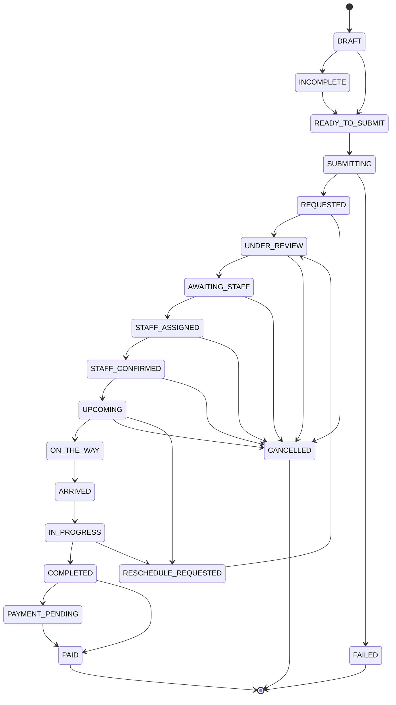

# Client State Matrix

This document defines every state a care request or booking can be in, from the client's perspective, including how it is presented in the UI.

## Overview Diagram

## State Definitions

### 1. DRAFT
| Field | Value |
|-------|-------|
| State ID | DRAFT |
| Badge Label | Draft |
| Badge Color | gray-100/gray-700 |
| Dashboard Headline | Finish your care request |
| Dashboard Description | You have an incomplete care request. Continue where you left off. |
| Primary CTA | Continue Request |
| Allowed Actions | Delete |
| Possible Next States | INCOMPLETE, READY_TO_SUBMIT |
| Client Notification | None |
| Timeline Position | N/A |

### 2. INCOMPLETE
| Field | Value |
|-------|-------|
| State ID | INCOMPLETE |
| Badge Label | Incomplete |
| Badge Color | gray-100/gray-700 |
| Dashboard Headline | Missing information |
| Dashboard Description | Please complete all required fields to submit your request. |
| Primary CTA | Complete Request |
| Allowed Actions | Delete |
| Possible Next States | READY_TO_SUBMIT |
| Client Notification | None |
| Timeline Position | N/A |

### 3. READY_TO_SUBMIT
| Field | Value |
|-------|-------|
| State ID | READY_TO_SUBMIT |
| Badge Label | Ready |
| Badge Color | blue-100/blue-700 |
| Dashboard Headline | Ready to submit |
| Dashboard Description | Review your details and submit your care request. |
| Primary CTA | Submit Now |
| Allowed Actions | Edit, Delete |
| Possible Next States | SUBMITTING |
| Client Notification | None |
| Timeline Position | N/A |

### 4. SUBMITTING
| Field | Value |
|-------|-------|
| State ID | SUBMITTING |
| Badge Label | Submitting |
| Badge Color | blue-100/blue-700 |
| Dashboard Headline | Submitting request |
| Dashboard Description | Please wait while we process your request. |
| Primary CTA | None |
| Allowed Actions | None |
| Possible Next States | REQUESTED, FAILED |
| Client Notification | None |
| Timeline Position | N/A |

### 5. REQUESTED
| Field | Value |
|-------|-------|
| State ID | REQUESTED |
| Badge Label | Request Received |
| Badge Color | teal-100/teal-700 |
| Dashboard Headline | We've received your request |
| Dashboard Description | Our team is acknowledging your care request. |
| Primary CTA | View Details |
| Allowed Actions | Cancel |
| Possible Next States | UNDER_REVIEW, CANCELLED |
| Client Notification | Email: Request Received |
| Timeline Position | Step 1 |

### 6. UNDER_REVIEW
| Field | Value |
|-------|-------|
| State ID | UNDER_REVIEW |
| Badge Label | Under Review |
| Badge Color | teal-100/teal-700 |
| Dashboard Headline | We're reviewing your care request |
| Dashboard Description | Our operations team is reviewing your requirements to find the best match. |
| Primary CTA | View Details |
| Allowed Actions | Cancel, Contact Support |
| Possible Next States | AWAITING_STAFF, CANCELLED |
| Client Notification | None |
| Timeline Position | Step 2 |

### 7. AWAITING_STAFF
| Field | Value |
|-------|-------|
| State ID | AWAITING_STAFF |
| Badge Label | Finding Caregiver |
| Badge Color | blue-100/blue-700 |
| Dashboard Headline | Finding the perfect match |
| Dashboard Description | We are currently assigning a qualified caregiver to your request. |
| Primary CTA | View Details |
| Allowed Actions | Cancel, Contact Support |
| Possible Next States | STAFF_ASSIGNED, CANCELLED |
| Client Notification | Email/SMS: Searching for Caregiver |
| Timeline Position | Step 3 |

### 8. STAFF_ASSIGNED
| Field | Value |
|-------|-------|
| State ID | STAFF_ASSIGNED |
| Badge Label | Caregiver Assigned |
| Badge Color | green-100/green-700 |
| Dashboard Headline | Caregiver Assigned |
| Dashboard Description | We have assigned a caregiver. Awaiting final confirmation. |
| Primary CTA | View Caregiver Profile |
| Allowed Actions | Cancel, Contact Support |
| Possible Next States | STAFF_CONFIRMED, CANCELLED |
| Client Notification | Email/SMS: Caregiver Assigned |
| Timeline Position | Step 4 |

### 9. STAFF_CONFIRMED
| Field | Value |
|-------|-------|
| State ID | STAFF_CONFIRMED |
| Badge Label | Confirmed |
| Badge Color | green-100/green-700 |
| Dashboard Headline | Booking Confirmed |
| Dashboard Description | Your caregiver is confirmed and scheduled. |
| Primary CTA | View Details |
| Allowed Actions | Cancel, Contact Support |
| Possible Next States | UPCOMING, CANCELLED |
| Client Notification | Email/SMS: Booking Confirmed |
| Timeline Position | Step 5 |

### 10. UPCOMING
| Field | Value |
|-------|-------|
| State ID | UPCOMING |
| Badge Label | Upcoming |
| Badge Color | blue-100/blue-700 |
| Dashboard Headline | Care is upcoming |
| Dashboard Description | Your scheduled care session is approaching. |
| Primary CTA | View Details |
| Allowed Actions | Reschedule, Cancel, Contact Support |
| Possible Next States | ON_THE_WAY, CANCELLED, RESCHEDULE_REQUESTED |
| Client Notification | SMS: Care Reminder |
| Timeline Position | Step 6 |

### 11. ON_THE_WAY
| Field | Value |
|-------|-------|
| State ID | ON_THE_WAY |
| Badge Label | On The Way |
| Badge Color | yellow-100/yellow-700 |
| Dashboard Headline | Caregiver is on the way |
| Dashboard Description | Your assigned caregiver is en route to the location. |
| Primary CTA | Track / Contact |
| Allowed Actions | Contact Support |
| Possible Next States | ARRIVED |
| Client Notification | SMS: Caregiver En Route |
| Timeline Position | Step 6 |

### 12. ARRIVED
| Field | Value |
|-------|-------|
| State ID | ARRIVED |
| Badge Label | Arrived |
| Badge Color | green-100/green-700 |
| Dashboard Headline | Caregiver has arrived |
| Dashboard Description | Your caregiver is at the location. |
| Primary CTA | View Details |
| Allowed Actions | Contact Support |
| Possible Next States | IN_PROGRESS |
| Client Notification | SMS: Caregiver Arrived |
| Timeline Position | Step 6 |

### 13. IN_PROGRESS
| Field | Value |
|-------|-------|
| State ID | IN_PROGRESS |
| Badge Label | In Progress |
| Badge Color | teal-100/teal-700 |
| Dashboard Headline | Care in progress |
| Dashboard Description | The care session is currently active. |
| Primary CTA | View Daily Log |
| Allowed Actions | Report Issue, Contact Support |
| Possible Next States | COMPLETED, RESCHEDULE_REQUESTED |
| Client Notification | None |
| Timeline Position | Step 7 |

### 14. COMPLETED
| Field | Value |
|-------|-------|
| State ID | COMPLETED |
| Badge Label | Completed |
| Badge Color | green-100/green-700 |
| Dashboard Headline | Care session completed |
| Dashboard Description | This care session has successfully concluded. |
| Primary CTA | Leave Feedback |
| Allowed Actions | Download Invoice, Contact Support |
| Possible Next States | PAYMENT_PENDING, PAID |
| Client Notification | Email/SMS: Care Completed & Feedback Request |
| Timeline Position | Post-Care |

### 15. PAYMENT_PENDING
| Field | Value |
|-------|-------|
| State ID | PAYMENT_PENDING |
| Badge Label | Payment Pending |
| Badge Color | red-100/red-700 |
| Dashboard Headline | Payment Required |
| Dashboard Description | An invoice is pending for this booking. |
| Primary CTA | Pay Now |
| Allowed Actions | Download Invoice, Contact Support |
| Possible Next States | PAID |
| Client Notification | Email/SMS: Payment Reminder |
| Timeline Position | Post-Care |

### 16. PAID
| Field | Value |
|-------|-------|
| State ID | PAID |
| Badge Label | Paid |
| Badge Color | green-100/green-700 |
| Dashboard Headline | Fully Paid |
| Dashboard Description | All dues are cleared for this booking. |
| Primary CTA | View Receipt |
| Allowed Actions | Download Invoice, Leave Feedback |
| Possible Next States | None |
| Client Notification | Email: Payment Receipt |
| Timeline Position | Post-Care |

### 17. RESCHEDULE_REQUESTED
| Field | Value |
|-------|-------|
| State ID | RESCHEDULE_REQUESTED |
| Badge Label | Reschedule Requested |
| Badge Color | orange-100/orange-700 |
| Dashboard Headline | Reschedule requested |
| Dashboard Description | A request to reschedule has been submitted to ops. |
| Primary CTA | View Details |
| Allowed Actions | Cancel, Contact Support |
| Possible Next States | UNDER_REVIEW |
| Client Notification | Email: Reschedule Acknowledged |
| Timeline Position | N/A |

### 18. CANCELLED
| Field | Value |
|-------|-------|
| State ID | CANCELLED |
| Badge Label | Cancelled |
| Badge Color | red-100/red-700 |
| Dashboard Headline | Booking Cancelled |
| Dashboard Description | This booking was cancelled. |
| Primary CTA | View Details |
| Allowed Actions | Re-book, Contact Support |
| Possible Next States | None |
| Client Notification | Email/SMS: Booking Cancelled |
| Timeline Position | N/A |

### 19. FAILED
| Field | Value |
|-------|-------|
| State ID | FAILED |
| Badge Label | Failed |
| Badge Color | red-100/red-700 |
| Dashboard Headline | Submission Failed |
| Dashboard Description | An error occurred during submission. |
| Primary CTA | Try Again |
| Allowed Actions | Contact Support |
| Possible Next States | None |
| Client Notification | None |
| Timeline Position | N/A |

---
*End of Document*
