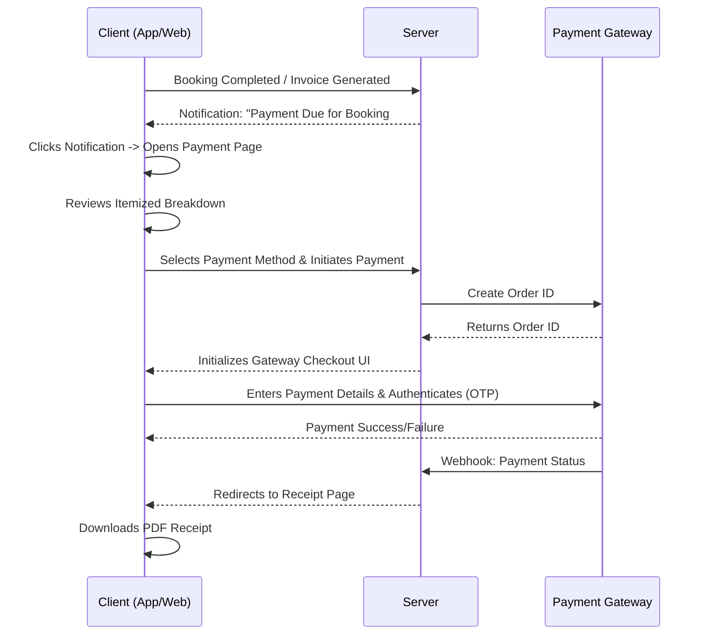

# CareConnect Client Experience Specification: Payment & Invoicing

**Document ID:** CC-UX-17
**Status:** IMPLEMENTATION-READY
**Author:** Senior UX/UI Planning Team
**Target Audience:** Frontend Developers, QA Engineers, Product Managers
**Version:** 1.0.0

## Overview
This document exhaustively details the payment and invoicing flow from the client's perspective for CareConnect. It covers payment methods, end-to-end payment flows, invoice specifications, payment history, and refund processes. The experience is designed to be seamless, trustworthy, and premium, reflecting our "Care Concierge" positioning in the Delhi NCR region.

---

## 1. Payment Methods

To provide maximum convenience and trust, CareConnect supports a comprehensive suite of payment options, heavily indexing on popular Indian digital payment methods.

### 1.1 UPI (Unified Payments Interface)
- **Supported Apps:** Google Pay (GPay), PhonePe, Paytm, BHIM, Amazon Pay, CRED Pay
- **UI Presentation:** 
  - Primary payment method (pre-selected by default)
  - Options for "Enter UPI ID" or "Scan QR Code" (if on desktop)
  - Direct app intent for mobile devices
- **Validation:** Real-time UPI ID validation (`@ybl`, `@okaxis`, etc.)

### 1.2 Credit / Debit Cards
- **Supported Networks:** Visa, Mastercard, RuPay, Maestro
- **UI Presentation:**
  - Secure input fields for Card Number, Expiry (MM/YY), CVV, and Name on Card
  - Auto-detection of card network based on BIN (first 6 digits) and displaying the respective logo
  - Option to "Save this card for future payments" (tokenized, never storing actual CVV)

### 1.3 Net Banking
- **Supported Banks:** All major Indian banks (SBI, HDFC, ICICI, Axis, Kotak, Punjab National Bank, etc.)
- **UI Presentation:**
  - Grid of top 6 popular banks with bank logos
  - Searchable dropdown for "Other Banks"

### 1.4 Digital Wallets
- **Supported Wallets:** Paytm, PhonePe Wallet, Amazon Pay, Mobikwik, Freecharge
- **UI Presentation:** List view with wallet logos and current balance check (if API permits)

### 1.5 Cash on Delivery (CoD)
- **Eligibility:** Available only for select services (e.g., Doctor Visit, single-session Physiotherapy). Disabled for long-term packages and high-value bookings.
- **UI Presentation:** 
  - Clear messaging: "Pay exactly ₹[Amount] in cash to the care professional upon completion."
  - Warning if exact change is recommended.

---

## 2. Payment Flow

The payment process initiates after the care visit is marked as completed by the operations team or upon booking confirmation (for prepaid services).

### 2.1 The End-to-End Sequence

### 2.2 Payment Page UI
- **Header:** "Complete Your Payment"
- **Booking Summary Card:**
  - Service Name (e.g., "Post-Operative Care - 3 Days")
  - Date & Time of Service
  - Care Professional Name
- **Itemized Breakdown (Same as Booking Wizard Step 9):**
  - Base Service Charge
  - Consumables / Extras (if applicable)
  - Taxes (GST)
  - Discounts / Promo Codes applied
  - **Total Amount Payable**
- **Payment Method Selection:** Accordion or vertical tab layout.

### 2.3 Payment Gateway Integration
- **Provider:** Razorpay / Cashfree (Standardized wrapper on frontend)
- **Interaction:** 
  - Standard checkout modal overlays the screen (no page redirect unless necessary for Netbanking).
  - Background is dimmed (backdrop blur).
  - "Do not press back or refresh" warning displayed during processing.

### 2.4 Success State
- **Visuals:** Large green checkmark animation, Confetti effect (subtle, premium).
- **Text:** "Payment Successful! Thank you for trusting CareConnect."
- **Actions:**
  - "View Invoice"
  - "Download Receipt (PDF)"
  - "Return to Dashboard"
- **Notification:** Immediate SMS and Email confirmation sent.

### 2.5 Failure State
- **Visuals:** Red/Orange warning icon.
- **Text:** "Payment Failed. Your account has not been charged." (Or "If money was deducted, it will be refunded within 3-5 days.")
- **Actions:**
  - "Retry Payment" (Primary CTA)
  - "Try a Different Method" (Secondary CTA)
  - "Contact Support" (Tertiary CTA)

---

## 3. Invoice Specification

The invoice must look professional, trustworthy, and legally compliant with Indian GST laws.

### 3.1 Data Format & Structure
- **Invoice Number:** `INV-2026-[XXXX]` (Auto-incrementing)
- **Date of Issue:** DD MMM YYYY, HH:MM AM/PM
- **Place of Supply:** Delhi (07), Haryana (06), UP (09) based on NCR location

### 3.2 Visual Layout Breakdown
1. **Header Section:**
   - CareConnect Logo (Left aligned)
   - "TAX INVOICE" label (Right aligned)
2. **Company Details (Right aligned under label):**
   - CareConnect Health Services Pvt. Ltd.
   - Address: [Corporate Office Address, Gurugram]
   - GSTIN: [GST Number]
   - PAN: [PAN Number]
3. **Client Details (Left aligned):**
   - Billed To: [Client Name]
   - Patient Name: [Patient Name] (If different)
   - Service Address: [Full address with PIN Code]
4. **Service Details Table:**
   - Columns: #, Description, HSN/SAC Code, Qty, Rate, Amount
   - Rows: Primary service, any additional items/consumables used.
5. **Tax & Total Breakdown (Bottom Right):**
   - Subtotal
   - CGST @ 9%: ₹ XX.XX
   - SGST @ 9%: ₹ XX.XX
   - **Grand Total (Rounded off): ₹ XXXX.00**
6. **Footer:**
   - "Payment Status: PAID on [Date via Method]"
   - Digital signature or "This is a computer-generated invoice."
   - Support contact details (care@careconnect.in | 1800-XXX-XXXX)

### 3.3 Download functionality
- Client clicks "Download as PDF"
- Frontend triggers an API call that returns a PDF blob.
- `window.URL.createObjectURL(blob)` is used to trigger download.
- Filename format: `CareConnect_Invoice_INV-2026-XXXX.pdf`

---

## 4. Payment History Page

Accessible via `Dashboard > Payments` or `Profile > Payment History`.

### 4.1 UI Layout
- **Page Title:** "Payment History"
- **Filters (Pill buttons):**
  - `All` (Default)
  - `Paid`
  - `Pending`
  - `Failed`
  - `Refunded`
- **List View Structure (Card per entry):**
  - **Left side:** 
    - Date (e.g., "Oct 12, 2026")
    - Service Type ("Physiotherapy Session")
    - Invoice Number ("#INV-2026-0492")
  - **Right side:**
    - Amount (e.g., "₹1,500")
    - Status Badge (Green for Paid, Yellow for Pending, Red for Failed)
  - **Action Menu (Three dots or visible buttons):**
    - "Download Invoice" (Disabled if Pending/Failed)
    - "View Details"
    - "Pay Now" (Only visible for Pending)

### 4.2 Empty State
- **Visual:** Calm, minimalist illustration of a clean slate or receipt.
- **Text:** "No payment history yet."
- **Subtext:** "Your past payments and invoices will appear here."

### 4.3 Pagination/Infinite Scroll
- Load 10 items per page.
- "Load More" button or infinite scroll trigger at the bottom of the list.

---

## 5. Refund Flow

Refunds are a critical touchpoint for trust. The flow must be transparent and reassuring.

### 5.1 Client Requests Cancellation
- Navigates to `Booking Details` > `Cancel Booking`.
- Prompts for cancellation reason.
- System automatically calculates refund eligibility based on policy.

### 5.2 Refund Policy Logic
- **> 24 hours** before scheduled start: 100% Full Refund.
- **12 to 24 hours** before scheduled start: 50% Refund (Late cancellation fee applies).
- **< 12 hours** before scheduled start or No-Show: 0% No Refund.
- **Provider Cancellation:** If CareConnect cancels, 100% Refund always.

### 5.3 UI Presentation of Refund
- A confirmation modal shows the calculated refund amount *before* finalizing the cancellation.
- Text: "Based on our cancellation policy, you are eligible for a refund of ₹[Amount]. Do you wish to proceed?"

### 5.4 Refund Processing
- Once confirmed, status changes to "Cancelled - Refund Initiated".
- Client receives SMS/Email notification with Refund Reference Number.
- **Timeline Display:** "Your refund of ₹[Amount] will reflect in your original payment method within 5-7 business days."

### 5.5 Refund Status Tracking
- In Payment History, the entry shows as "Refunded".
- Clicking "View Details" shows a timeline:
  - ✅ Refund Initiated (Date)
  - ✅ Processed by Gateway (Date)
  - ⏳ Credited to Bank (Expected by Date)

---

## 6. Accessibility & i18n
- **A11y:** All payment forms must have proper `aria-labels` and `autocomplete` attributes (e.g., `autocomplete="cc-number"`). Focus management must trap focus inside the payment modal.
- **Screen Readers:** Read out total amounts clearly, e.g., "Total payable amount, Rupees one thousand five hundred".
- **i18n Readiness:** While currently English-only, currency formatting must use `Intl.NumberFormat('en-IN', { style: 'currency', currency: 'INR' })`.

## 7. Design Tokens Utilized
- **Brand Teal (`#0EA5A4`):** Used for Primary Buttons ("Pay Now"), active tab underlines, and Success checkmarks.
- **Canvas (`#F8FAFC`):** Background for the Payment History list and structural areas.
- **White (`#FFFFFF`):** Background for individual invoice cards and payment method cards.
- **Blue (`#2563EB`):** Used for informational callouts (e.g., "Your payment is secure").
- **Red/Orange:** Used strictly for failures and warnings.
- **Typography:** Inter or Roboto, with strict hierarchy (H1 for page titles, H2 for sections, body for details).

---
*End of Specification CC-UX-17*
